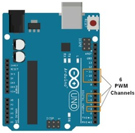
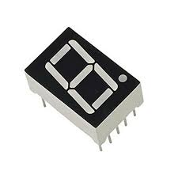
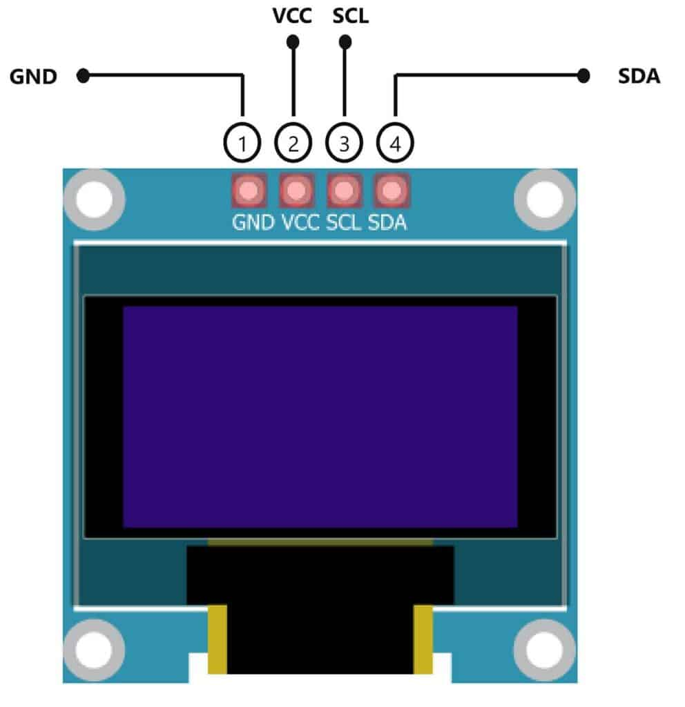

#### Introduction

Output components are essential elements of embedded systems as they allow the system to communicate information, status, or results to the user. These components convert electrical signals from the microcontroller into visible or audible outputs such as light, text, or sound.

In this experiment, basic output components including **RGB LED, 7-segment display, OLED display, 16×2 LCD display, and buzzer** are interfaced with an Arduino microcontroller. The experiment helps learners understand how Arduino generates digital, PWM, and communication-based signals to control various output devices. These concepts are widely used in real-world embedded systems and IoT applications.

#### Arduino Output Control Mechanism

Arduino controls output components using different methods depending on the type of device:

- **Digital Output Pins** – Used to generate HIGH or LOW signals  
- **PWM Pins** – Used for variable control such as brightness or intensity  
- **Communication Interfaces** – Used for advanced devices (I2C, SPI)

Common Arduino functions used for output control include:

- `digitalWrite()`  
- `analogWrite()`  
- `tone()`  
- Library-based display control functions  

#### Components

#### 1. **RGB LED**

An RGB LED consists of three individual LEDs—Red, Green, and Blue—combined in a single package. By varying the intensity of each color, multiple color combinations can be produced.

Each color pin of the RGB LED is connected to a PWM pin of Arduino using current-limiting resistors. The brightness of each color is controlled using the `analogWrite()` function.

**Applications:**
- Status indicators  
- Mood lighting  
- Visual alerts  

#### 2. **7-Segment Display**

A 7-segment display consists of seven LEDs arranged in a specific pattern to display numeric characters from 0 to 9.

There are two common types of 7-segment displays:
- **Common Cathode**
- **Common Anode**

Each segment is connected to a digital output pin of Arduino. By activating different combinations of segments, numeric digits can be displayed.

**Applications:**
- Digital counters  
- Clocks  
- Measurement displays  

#### 3. **OLED Display**

OLED (Organic Light Emitting Diode) displays generate light independently without the need for a backlight. This results in high contrast, better visibility, and low power consumption.

OLED displays commonly use **I2C communication** to interface with Arduino. A typical I2C address for OLED modules is **0x3C**. These displays are controlled using dedicated display libraries.

**Applications:**
- Sensor data visualization  
- Wearable devices  
- Compact dashboards  

#### 4. **16×2 LCD Display**

A 16×2 LCD display is capable of displaying 16 characters per line on two lines. It uses an internal controller to manage character display and cursor positioning.

The LCD can operate in **4-bit or 8-bit mode**. A potentiometer is used to adjust display contrast. The **LiquidCrystal** library is commonly used for interfacing the LCD with Arduino.

**Applications:**
- Information panels  
- Menu systems  
- Embedded user interfaces  

#### 5. **Buzzer**

A buzzer is an audio output device that converts electrical signals into sound.

There are two main types of buzzers:
- **Active Buzzer** – Generates sound directly when powered  
- **Passive Buzzer** – Requires frequency input to produce sound  

The buzzer is connected to a digital pin of Arduino and controlled using `digitalWrite()` or `tone()` functions.

**Applications:**
- Alerts and alarms  
- Notifications  
- Warning systems  

#### Circuit Connections

1. **RGB LED Connection**
   - Red, Green, and Blue pins connected to **PWM pins**
   - Common pin connected to **GND or VCC**
   - Current-limiting resistors used

2. **7-Segment Display Connection**
   - Each segment connected to a **digital output pin**
   - Common anode or cathode connected accordingly

3. **OLED Display Connection**
   - SDA and SCL connected to **I2C pins**
   - Powered using **VCC and GND**

4. **16×2 LCD Connection**
   - Data and control pins connected to **digital pins**
   - Potentiometer used for contrast adjustment

5. **Buzzer Connection**
   - Positive terminal connected to a **digital pin**
   - Negative terminal connected to **GND**

#### Conclusion

This experiment demonstrates how Arduino interfaces with different output components to generate visual and audio responses. Understanding these output devices is essential for designing interactive embedded systems and IoT-based applications.

